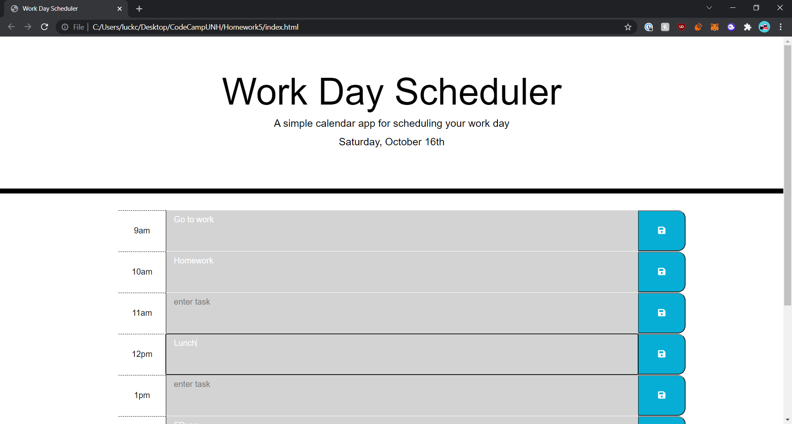

# Work Day

This projects title is Work Day Scheduler and it is a website that I coded the javascript,html,css for using my new found coding skills so that it follows acceptance criteria. 

## Languages

javascript
css
html

## Objective

GIVEN I am using a daily planner to create a schedule
WHEN I open the planner
THEN the current day is displayed at the top of the calendar
WHEN I scroll down
THEN I am presented with timeblocks for standard business hours
WHEN I view the timeblocks for that day
THEN each timeblock is color coded to indicate whether it is in the past, present, or future
WHEN I click into a timeblock
THEN I can enter an event
WHEN I click the save button for that timeblock
THEN the text for that event is saved in local storage
WHEN I refresh the page
THEN the saved events persist

## What was learned

I learned a lot more about how to use eventlisteners as well as various loops in javascript such as do while loops and switch case. I also learned a lot more on how to utilize local storage to store data and use the data later on in the program. I learned a lot more about how to use the moment library.

## Project pictures/websitelink 

Screenshots below!

Link to Password Generator
[Password Generator](https://cluck135.github.io/Work-Day-Scheduler/)

